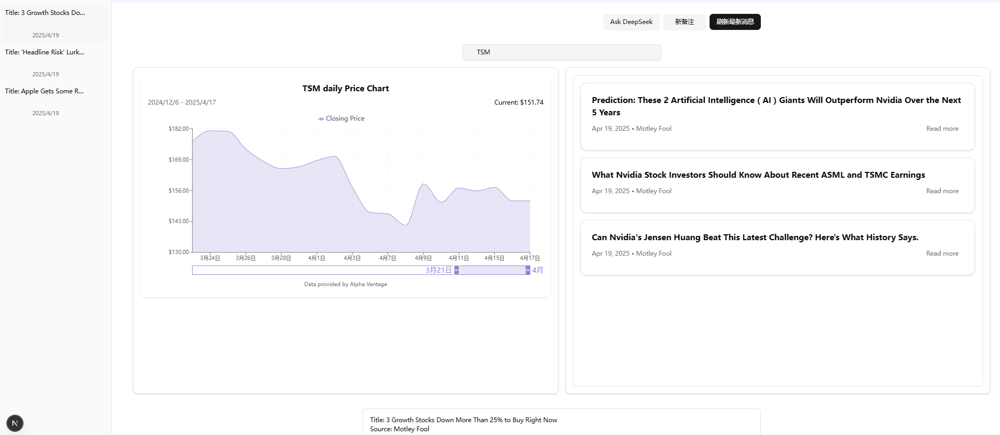

# 📈 StockNews AI Notes


一个结合实时金融数据与AI交互的智能笔记网站

## 🚀 核心功能

1. **智能金融仪表盘**

   - 实时美股数据可视化（Alpha Vantage API）

2. **AI笔记功能**

   - 金融助理对话系统
   - 技术指标解释助手

3. **数据管理系统**
   - Supabase实时数据库集成
   - Prisma ORM数据建模
   - 用户数据加密存储

## 📝 项目展示



## 📥 安装指南

```bash
# 克隆仓库
git clone https://github.com/JP3000/AI-FinanceNotes.git

# 安装依赖
npm install

# 复制环境配置
cp .env.local

# 必要环境变量配置（替换以下值）：
# 数据库配置
DATABASE_URL=your-database-url
# Supabase配置
SUPABASE_URL=your-supabase-url
SUPABASE_ANON_KEY=your-supabase-key
# API密钥
ALPHA_VANTAGE_API_KEY=your_alpha_vantage_key
DEEPSEEK_API_KEY=your_deepseek_key
# 基础URL
NEXT_PUBLIC_BASE_URL=http://localhost:3000
# 可选开发配置
NEXT_PUBLIC_DEEPSEEK_API_URL='https://api.deepseek.com'

```

### Windows系统特别配置

1. **路径配置**：
   ```json
   // package.json
   {
     "scripts": {
       "prisma:generate": "pnpm dlx prisma generate",
       "prisma:migrate": "dotenv -e .env.local -- pnpm dlx prisma migrate dev",
       "prisma:studio": "pnpm dlx prisma studio",
       "migrate": "pnpm run prisma:generate && pnpm run prisma:migrate"
     },
     "prisma": {
       "schema": "src/db/schema.prisma"
     }
   }
   ```

## 🙏 致谢

- [Cole Blender](https://www.youtube.com/watch?v=6ChzCaljcaI) - [AI Notes系列教程](https://www.youtube.com/watch?v=6ChzCaljcaI) 对本项目的启发
- [Alpha Vantage](https://www.alphavantage.co/) - 金融数据服务
